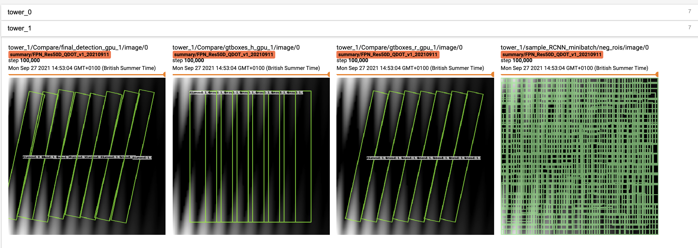

# CoulombDet

[](https://opensource.org/licenses/Apache-2.0)

**Papers and codes related to remote sensing/aerial image detection: [DOTA-DOAI](https://github.com/SJTU-Thinklab-Det/DOTA-DOAI) .**      


## Projects


## Latest Performance

More results and trained models are available in the [MODEL_ZOO.md](MODEL_ZOO.md).

### DOTA (Task1)
Base setting: 

|   Backbone  |  Neck  |  Training/test dataset  | Data Augmentation | Epoch |      
|:-----------:|:------:|:-----------------------:|:-----------------:|:-----:|
| ResNet50_v1d 600->800 | FPN | trainval/test | × | **13 (AP50) or 17 (AP50:95) is enough for baseline (default is 13)** |

| Method | Baseline |    DOTA1.0  |   DOTA1.5   |   DOTA2.0   | Model | Anchor | Angle Pred. | Reg. Loss| Angle Range | Configs |      
|:------------:|:------------:|:-----------:|:----------:|:-----------:|:----------:|:-----------:|:-----------:|:-----------:|:---------:|:---------:|    
| - | [RetinaNet-R](https://arxiv.org/abs/1908.05612) | 67.25 | 56.50 | 42.04 | [Baidu Drive (bi8b)](https://pan.baidu.com/s/1s9bdXWhx307Egdnmz0hLBw) | **R** | Reg. (∆⍬) | smooth L1 | [-90,0)  | [dota1.0,](./libs/configs/DOTA/retinanet/cfgs_res50_dota_v7.py) [dota1.5,](./libs/configs/DOTA1.5/retinanet/cfgs_res50_dota1.5_v7.py) [dota2.0](./libs/configs/DOTA2.0/retinanet/cfgs_res50_dota2.0_v7.py) |
| - | [RetinaNet-H](https://arxiv.org/abs/1908.05612) | 64.17 | 56.10 | 43.06 | [Baidu Drive (bi8b)](https://pan.baidu.com/s/1s9bdXWhx307Egdnmz0hLBw) | H | Reg. (∆⍬) | smooth L1 | **[-90,90)**  | [dota1.0,](./libs/configs/DOTA/retinanet/cfgs_res50_dota_v15.py) [dota1.5,](./libs/configs/DOTA1.5/retinanet/cfgs_res50_dota1.5_v15.py) [dota2.0](./libs/configs/DOTA2.0/retinanet/cfgs_res50_dota2.0_v15.py) |
| - | [RetinaNet-H](https://arxiv.org/abs/1908.05612) | 65.78 | 57.17 | 43.92 | [Baidu Drive (bi8b)](https://pan.baidu.com/s/1s9bdXWhx307Egdnmz0hLBw) | H | Reg. **(sin⍬, cos⍬)** | smooth L1 | [-90,90)  | [dota1.0,](./libs/configs/DOTA/retinanet/cfgs_res50_dota_atan_v5.py) [dota1.5,](./libs/configs/DOTA1.5/retinanet/cfgs_res50_dota1.5_atan_v5.py) [dota2.0](./libs/configs/DOTA2.0/retinanet/cfgs_res50_dota2.0_atan_v5.py) |
| - | [RetinaNet-H](https://arxiv.org/abs/1908.05612) | 65.73 | 58.87 | 44.16 | [Baidu Drive (bi8b)](https://pan.baidu.com/s/1s9bdXWhx307Egdnmz0hLBw) | H | Reg. (∆⍬) | smooth L1 | **[-90,0)**  | [dota1.0,](./libs/configs/DOTA/retinanet/cfgs_res50_dota_v4.py) [dota1.5,](./libs/configs/DOTA1.5/retinanet/cfgs_res50_dota1.5_v4.py) [dota2.0](./libs/configs/DOTA2.0/retinanet/cfgs_res50_dota2.0_v4.py)|
| [IoU-Smooth L1](https://arxiv.org/abs/1811.07126) | [RetinaNet-H](https://arxiv.org/abs/1908.05612) | 66.99 | 59.17 | 46.31 | [Baidu Drive (qcvc)](https://pan.baidu.com/s/1NmiEzQmiYi7H0OJMqoryqQ) | H | Reg. (∆⍬) | **iou-smooth L1** | [-90,0)  | [dota1.0,](./libs/configs/DOTA/retinanet/cfgs_res50_dota_v5.py) [dota1.5,](./libs/configs/DOTA1.5/retinanet/cfgs_res50_dota1.5_v5.py) [dota2.0](./libs/configs/DOTA2.0/retinanet/cfgs_res50_dota2.0_v5.py) |
| [RIDet](https://arxiv.org/abs/2103.11636) | [RetinaNet-H](https://arxiv.org/abs/1908.05612) | 66.06 | 58.91 | 45.35 | [Baidu Drive (njjv)](https://pan.baidu.com/s/1w3qech_ZmYESVxoiaTbBSw) | H | Quad. | hungarian loss | -  | [dota1.0,](./libs/configs/DOTA/ridet/cfgs_res50_dota_ridet_8p_v1.py) [dota1.5,](./libs/configs/DOTA1.5/ridet/cfgs_res50_dota1.5_ridet_8p_v1.py) [dota2.0](./libs/configs/DOTA2.0/ridet/cfgs_res50_dota2.0_ridet_8p_v1.py) |
| [RSDet](https://arxiv.org/pdf/1911.08299) | [RetinaNet-H](https://arxiv.org/abs/1908.05612) | 67.27 | 61.42 | 46.71 | [Baidu Drive (2a1f)](https://pan.baidu.com/s/1m8pSOZX50_Bsv-WuJKo_DQ) | H | Quad. | modulated loss | -  | [dota1.0,](./libs/configs/DOTA/rsdet/cfgs_res50_dota_rsdet_v2.py) [dota1.5,](./libs/configs/DOTA1.5/rsdet/cfgs_res50_dota1.5_rsdet_8p_v2.py) [dota2.0](./libs/configs/DOTA2.0/rsdet/cfgs_res50_dota2.0_rsdet_8p_v2.py) |
| [CSL](https://arxiv.org/abs/2003.05597) | [RetinaNet-H](https://arxiv.org/abs/1908.05612) | 67.38 | 58.55 | 43.34 | [Baidu Drive (sdbb)](https://pan.baidu.com/s/1ULnKq0sh1LtjF46YPP4iKA) | H | **Cls.: Gaussian (r=1, w=10)** | smooth L1 | [-90,90) | [dota1.0,](./libs/configs/DOTA/csl/cfgs_res50_dota_v45.py) [dota1.5,](./libs/configs/DOTA1.5/csl/cfgs_res50_dota1.5_csl_v45.py) [dota2.0](./libs/configs/DOTA2.0/csl/cfgs_res50_dota2.0_csl_v45.py) |
| [DCL](https://arxiv.org/abs/2011.09670) | [RetinaNet-H](https://arxiv.org/abs/1908.05612) | 67.39 | 59.38 | 45.46 | [Baidu Drive (m7pq)](https://pan.baidu.com/s/1lrdPZm1hVfupPrTnB8cYjw) | H | **Cls.: BCL (w=180/256)** | smooth L1 | [-90,90)  | [dota1.0,](./libs/configs/DOTA/dcl/cfgs_res50_dota_dcl_v5.py) [dota1.5,](./libs/configs/DOTA1.5/dcl/cfgs_res50_dota1.5_dcl_v5.py) [dota2.0](./libs/configs/DOTA2.0/dcl/cfgs_res50_dota2.0_dcl_v5.py) |
| - | [FCOS](https://arxiv.org/abs/1904.01355) | 67.69 | 61.05 | 48.10 | [Baidu Drive (pic4)](https://pan.baidu.com/s/1Ge0RnMHIp3NIfqGAzZZkkA) | - | Quad | smooth L1 | -  | [dota1.0,](./libs/configs/DOTA/fcos/cfgs_res50_dota_fcos_v1.py) [dota1.5,](./libs/configs/DOTA1.5/fcos/cfgs_res50_dota1.5_fcos_v1.py) [dota2.0](./libs/configs/DOTA2.0/fcos/cfgs_res50_dota2.0_fcos_v1.py) |
| [RSDet](https://arxiv.org/pdf/1911.08299) | [FCOS](https://arxiv.org/abs/1904.01355) | 67.91 | 62.18 | 48.81 | [Baidu Drive (8ww5)](https://pan.baidu.com/s/1gH4WT4_ZNyYtUwnuZM5iUg) | - | Quad | modulated loss | -  | [dota1.0,](./libs/configs/DOTA/fcos/cfgs_res50_dota_fcos_v3.py) [dota1.5](./libs/configs/DOTA1.5/fcos/cfgs_res50_dota1.5_fcos_v2.py) [dota2.0](./libs/configs/DOTA2.0/fcos/cfgs_res50_dota2.0_fcos_v2.py) |
| [GWD](https://arxiv.org/abs/2101.11952) | [RetinaNet-H](https://arxiv.org/abs/1908.05612) | 68.93 | 60.03 | 46.65 | [Baidu Drive (7g5a)](https://pan.baidu.com/s/1D1pSOoq35lU3OkkUhErLBw) | H | Reg. (∆⍬) | **gwd** | [-90,0)  | [dota1.0,](./libs/configs/DOTA/gwd/cfgs_res50_dota_v10.py) [dota1.5,](./libs/configs/DOTA1.5/gwd/cfgs_res50_dota1.5_v11.py) [dota2.0](./libs/configs/DOTA2.0/gwd/cfgs_res50_dota2.0_v11.py) |
| [GWD](https://arxiv.org/abs/2101.11952) **[+ SWA](https://arxiv.org/pdf/2012.12645.pdf)**  | [RetinaNet-H](https://arxiv.org/abs/1908.05612) |  69.92 | 60.60 | 47.63 | [Baidu Drive (qcn0)](https://pan.baidu.com/s/1kZ2kCMIwJSODgfayypTMNw) | H | Reg. (∆⍬) | gwd | [-90,0)  | [dota1.0,](./libs/configs/DOTA/gwd/cfgs_res50_dota_v10.py) [dota1.5,](./libs/configs/DOTA1.5/gwd/cfgs_res50_dota1.5_v11.py) [dota2.0](./libs/configs/DOTA2.0/gwd/cfgs_res50_dota2.0_v11.py) |
| [KLD](https://arxiv.org/abs/2106.01883) | [RetinaNet-H](https://arxiv.org/abs/1908.05612) | 71.28 | 62.50 | 47.69 | [Baidu Drive (o6rv)](https://pan.baidu.com/s/1nymEcwYEWoW4vcIxCYEsyw) | H | Reg. (∆⍬) | **kld** | [-90,0) | [dota1.0,](./libs/configs/DOTA/kl/cfgs_res50_dota_kl_v5.py) [dota1.5,](./libs/configs/DOTA1.5/kl/cfgs_res50_dota1.5_kl_v6.py) [dota2.0](./libs/configs/DOTA2.0/kl/cfgs_res50_dota2.0_kl_v5.py) |
| [R<sup>3</sup>Det](https://arxiv.org/abs/1908.05612) | [RetinaNet-H](https://arxiv.org/abs/1908.05612) | 70.66 | 62.91 | 48.43 | [Baidu Drive (n9mv)](https://pan.baidu.com/s/1mCKXkTgyBUzmEJz5sng0UA) | H->R | Reg. (∆⍬) | smooth L1 | [-90,0)  | [dota1.0,](./libs/configs/DOTA/r3det/cfgs_res50_dota_r3det_v1.py) [dota1.5,](./libs/configs/DOTA1.5/r3det/cfgs_res50_dota1.5_r3det_v1.py) [dota2.0](./libs/configs/DOTA2.0/r3det/cfgs_res50_dota2.0_r3det_v1.py) |
| [DCL](https://arxiv.org/abs/2011.09670) | [R<sup>3</sup>Det](https://arxiv.org/abs/1908.05612) | 71.21 | 61.98 | 48.71 | [Baidu Drive (eg2s)](https://pan.baidu.com/s/18M0JJ-PBpauPzoImigweyw) | H->R | **Cls.: BCL (w=180/256)** | iou-smooth L1 | [-90,0)->[-90,90)  | [dota1.0,](./libs/configs/DOTA/r3det_dcl/cfgs_res50_dota_r3det_dcl_v1.py) [dota1.5,](./libs/configs/DOTA1.5/r3det_dcl/cfgs_res50_dota1.5_r3det_dcl_v2.py) [dota2.0](./libs/configs/DOTA2.0/r3det_dcl/cfgs_res50_dota2.0_r3det_dcl_v2.py) |
| [GWD](https://arxiv.org/abs/2101.11952) | [R<sup>3</sup>Det](https://arxiv.org/abs/1908.05612) | 71.56 | 63.22 | 49.25 | [Baidu Drive (jb6e)](https://pan.baidu.com/s/1DmluE1rOs377bZQMT2Y0tg) | H->R | Reg. (∆⍬) | **smooth L1->gwd** | [-90,0)  | [dota1.0,](./libs/configs/DOTA/r3det_gwd/cfgs_res50_dota_r3det_gwd_v6.py) [dota1.5,](./libs/configs/DOTA1.5/r3det_gwd/cfgs_res50_1.5_dota_r3det_gwd_v6.py) [dota2.0](./libs/configs/DOTA2.0/r3det_gwd/cfgs_res50_2.0_dota_r3det_gwd_v6.py) |
| [KLD](https://arxiv.org/abs/2106.01883) | [R<sup>3</sup>Det](https://arxiv.org/abs/1908.05612) | 71.73 | 65.18 | 50.90 | [Baidu Drive (tq7f)](https://pan.baidu.com/s/1ORscIxy4ccx_bj4knJk1qw) | H->R | Reg. (∆⍬) | **kld** | [-90,0)  | [dota1.0,](./libs/configs/DOTA/r3det_kl/cfgs_res50_dota_r3det_kl_v2.py) [dota1.5,](./libs/configs/DOTA1.5/r3det_kl/cfgs_res50_dota1.5_r3det_kl_v2.py) [dota2.0](./libs/configs/DOTA2.0/r3det_kl/cfgs_res50_dota2.0_r3det_kl_v2.py) |
| - | [R<sup>2</sup>CNN (Faster-RCNN)](https://arxiv.org/abs/1706.09579) | 72.27 | 66.45 | 52.35 | [Baidu Drive (02s5)](https://pan.baidu.com/s/1tdIc2IUouVwrwUSIbNdvWg) | H->R | Reg. (∆⍬) | smooth L1 | [-90,0)  | [dota1.0,](./libs/configs/DOTA/r2cnn/cfgs_res50_dota_v1.py) [dota1.5](./libs/configs/DOTA1.5/r2cnn/cfgs_res50_dota1.5_r2cnn_v1.py) [dota2.0](./libs/configs/DOTA2.0/r2cnn/cfgs_res50_dota2.0_r2cnn_v1.py) |

**Note:**    
- Single GPU training: [SAVE_WEIGHTS_INTE](./libs/configs/cfgs.py) = iter_epoch * 1 
- Multi-GPU training (**better**): [SAVE_WEIGHTS_INTE](./libs/configs/cfgs.py) = iter_epoch * 2

## My Development Environment
**docker images: yangxue2docker/yx-tf-det:tensorflow1.13.1-cuda10-gpu-py3 or yangxue2docker/py3-tf1.15.2-nv-torch1.8.0-cuda11:v1.0**        
1. python3.5 (anaconda recommend)               
2. cuda 10.0                     
3. opencv-python 4.1.1.26         
4. [tfplot 0.2.0](https://github.com/wookayin/tensorflow-plot) (optional)            
5. tensorflow-gpu 1.13
6. tqdm 4.54.0
7. Shapely 1.7.1

**Note: For 30xx series graphics cards, I recommend this [blog](https://blog.csdn.net/qq_39543404/article/details/112171851) to install tf1.xx, or refer to [ngc](https://ngc.nvidia.com/catalog/containers/nvidia:tensorflow) and [tensorflow-release-notes](https://docs.nvidia.com/deeplearning/frameworks/tensorflow-release-notes/rel_20-11.html#rel_20-11) to download docker image according to your environment, or just use my docker image (yangxue2docker/py3-tf1.15.2-nv-torch1.8.0-cuda11:v1.0)**

## Download Model
### Pretrain weights
Download a pretrain weight you need from the following three options, and then put it to $PATH_ROOT/dataloader/pretrained_weights. 
1. MxNet pretrain weights **(recommend in this repo, default in [NET_NAME](/Users/yangxue/Desktop/yangxue/code/RotationDetection/libs/configs/_base_/models/retinanet_r50_fpn.py))**: resnet_v1d, resnet_v1b, refer to [gluon2TF](./thirdparty/gluon2TF/README.md).    
* [Baidu Drive (5ht9)](https://pan.baidu.com/s/1GpqKg0dOaaWmwshvv1qWGg)          
* [Google Drive](https://drive.google.com/drive/folders/1BM8ffn1WnsRRb5RcuAcyJAHX8NS2M1Gz?usp=sharing)  
2. Tensorflow pretrain weights: [resnet50_v1](http://download.tensorflow.org/models/resnet_v1_50_2016_08_28.tar.gz), [resnet101_v1](http://download.tensorflow.org/models/resnet_v1_101_2016_08_28.tar.gz), [resnet152_v1](http://download.tensorflow.org/models/resnet_v1_152_2016_08_28.tar.gz), [efficientnet](https://github.com/tensorflow/tpu/tree/master/models/official/efficientnet), [mobilenet_v2](https://storage.googleapis.com/mobilenet_v2/checkpoints/mobilenet_v2_1.0_224.tgz), darknet53 ([Baidu Drive (1jg2)](https://pan.baidu.com/s/1p8V9aaivo9LNxa_OjXjUwA), [Google Drive](https://drive.google.com/drive/folders/1zyg1bvdmLxNRIXOflo_YmJjNJdpHX2lJ?usp=sharing)).      
3. Pytorch pretrain weights, refer to [pretrain_zoo.py](./dataloader/pretrained_weights/pretrain_zoo.py) and [Others](./OTHERS.md).
* [Baidu Drive (oofm)](https://pan.baidu.com/s/16nHwlkPsszBvzhMv4h2IwA)          
* [Google Drive](https://drive.google.com/drive/folders/14Bx6TK4LVadTtzNFTQj293cKYk_5IurH?usp=sharing)      


### Trained weights
1. Please download trained models by this project, then put them to $PATH_ROOT/output/pretained_weights.

## Compile
    ```  
    cd $PATH_ROOT/libs/utils/cython_utils
    rm *.so
    rm *.c
    rm *.cpp
    python setup.py build_ext --inplace (or make)
    
    cd $PATH_ROOT/libs/utils/
    rm *.so
    rm *.c
    rm *.cpp
    python setup.py build_ext --inplace
    ```

## Train 

1. If you want to train your own dataset, please note:  
    ```
    (1) Select the detector and dataset you want to use, and mark them as #DETECTOR and #DATASET (such as #DETECTOR=retinanet and #DATASET=DOTA)
    (2) Modify parameters (such as CLASS_NUM, DATASET_NAME, VERSION, etc.) in $PATH_ROOT/libs/configs/#DATASET/#DETECTOR/cfgs_xxx.py
    (3) Copy $PATH_ROOT/libs/configs/#DATASET/#DETECTOR/cfgs_xxx.py to $PATH_ROOT/libs/configs/cfgs.py
    (4) Add category information in $PATH_ROOT/libs/label_name_dict/label_dict.py     
    (5) Add data_name to $PATH_ROOT/dataloader/dataset/read_tfrecord.py  
    ```     

2. Make tfrecord       
    If image is very large (such as DOTA dataset), the image needs to be cropped. Take DOTA dataset as a example:      
    ```  
    cd $PATH_ROOT/dataloader/dataset/DOTA
    python data_crop.py
    ```  
    If image does not need to be cropped, just convert the annotation file into xml format, refer to [example.xml](./example.xml).
    ```  
    cd $PATH_ROOT/dataloader/dataset/  
    python convert_data_to_tfrecord.py --root_dir='/PATH/TO/DOTA/' 
                                       --xml_dir='labeltxt'
                                       --image_dir='images'
                                       --save_name='train' 
                                       --img_format='.png' 
                                       --dataset='DOTA'
    ```      
    

3. Start training
    ```  
    cd $PATH_ROOT/tools/#DETECTOR
    python train.py
    ```

## Test
1. For large-scale image, take DOTA dataset as a example (the output file or visualization is in $PATH_ROOT/tools/#DETECTOR/test_dota/VERSION): 
    ```  
    cd $PATH_ROOT/tools/#DETECTOR
    python test_dota.py --test_dir='/PATH/TO/IMAGES/'  
                        --gpus=0,1,2,3,4,5,6,7  
                        -ms (multi-scale testing, optional)
                        -s (visualization, optional)
    
    or (better than multi-scale testing)
    
    python test_dota_sota.py --test_dir='/PATH/TO/IMAGES/'  
                             --gpus=0,1,2,3,4,5,6,7  
                             -s (visualization, optional)
    ``` 

    **Notice: In order to set the breakpoint conveniently, the read and write mode of the file is' a+'. If the model of the same #VERSION needs to be tested again, the original test results need to be deleted.**

2. For small-scale image, take HRSC2016 dataset as a example: 
    ```  
    cd $PATH_ROOT/tools/#DETECTOR
    python test_hrsc2016.py --test_dir='/PATH/TO/IMAGES/'  
                            --gpu=0
                            --image_ext='bmp'
                            --test_annotation_path='/PATH/TO/ANNOTATIONS'
                            -s (visualization, optional)
    ``` 

## Tensorboard
```  
cd $PATH_ROOT/output/summary
tensorboard --logdir=.
``` 




## Reference
1、https://github.com/endernewton/tf-faster-rcnn   
2、https://github.com/zengarden/light_head_rcnn   
3、https://github.com/tensorflow/models/tree/master/research/object_detection    
4、https://github.com/fizyr/keras-retinanet     


